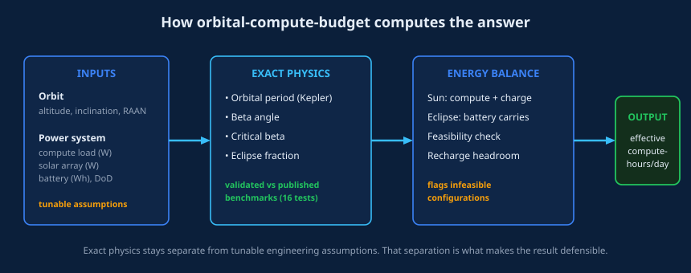
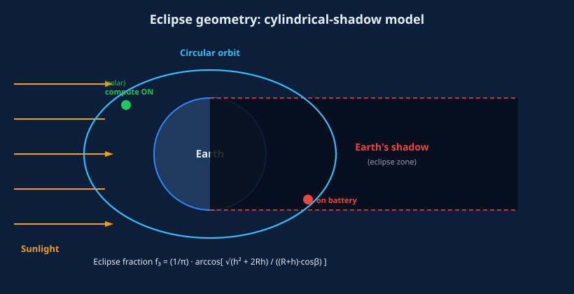
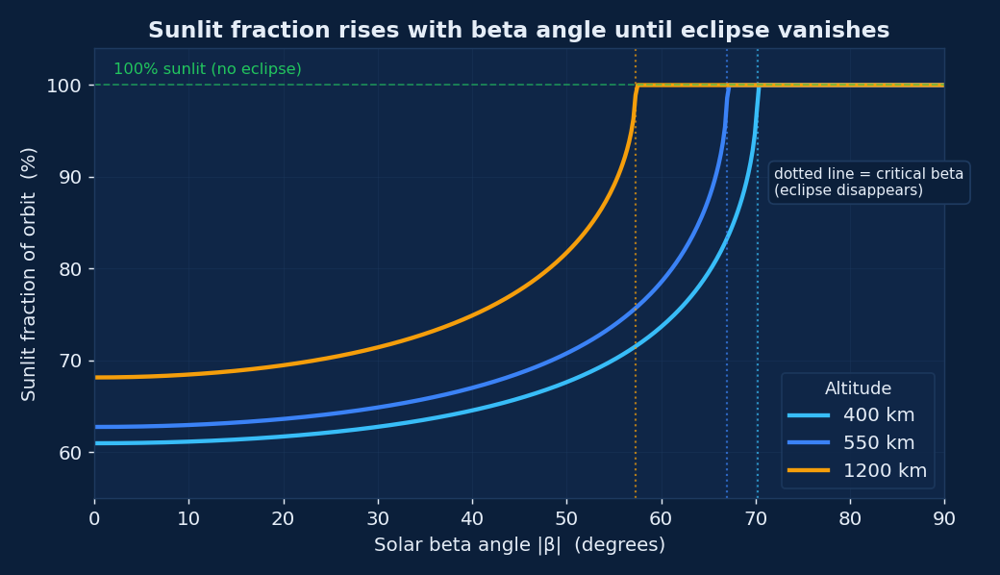
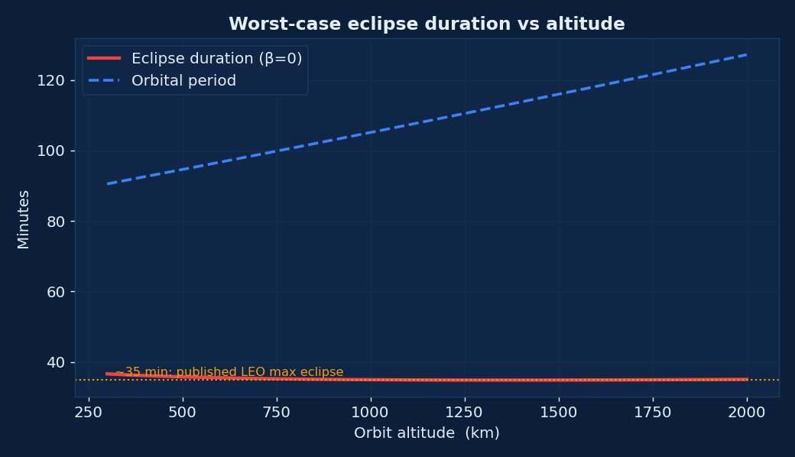
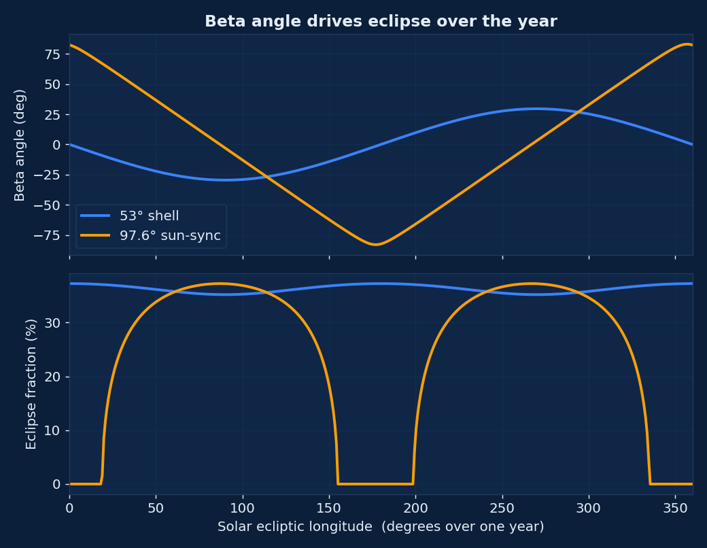
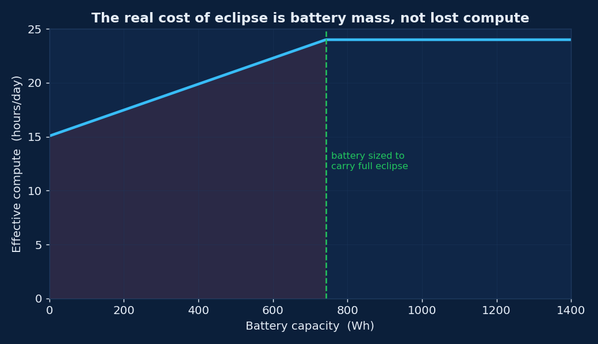

# orbital-compute-budget

### How much compute do you actually get from a data center in orbit?

**You give it an orbit and a power budget. It gives you the effective compute-hours per day, after eclipse and battery limits. The physics is exact and citable. The engineering assumptions are yours, and stay honest.**

*by [Tech4Biz Solutions](mailto:contact@tech4biz.io)*

---

## The problem

Data centers in space have moved from science fiction to funded engineering. Since January 2026 the FCC has received multiple applications for large satellite constellations that operate as orbital data centers, and the capital following the sector is now measured in tens of billions.

Yet the number that governs the entire economics is almost never stated cleanly:

> Given an orbit and a compute power draw, how much usable compute do you actually get per day, once you subtract eclipse, battery depth-of-discharge, and recharge headroom?

Everyone quotes "24/7 solar power in orbit." Reality is more precise. A satellite in low Earth orbit spends a large fraction of every orbit in sunlight, but at low beta angles it is eclipsed for up to about 35 minutes per orbit, roughly 16 times a day. Whether that eclipse costs you compute, or only costs you battery mass, depends on choices no public tool made explicit.

**orbital-compute-budget makes it explicit.** The eclipse and beta-angle physics is exact, closed-form, and validated against published spacecraft-power references. The power-system parameters are transparent, tunable inputs. The tool computes the consequence of your assumptions and flags the configurations that cannot physically work.

---

## How it works



Four stages. Inputs to exact physics to energy balance to a single defensible number. The physics layer never touches your assumptions, and your assumptions never contaminate the physics. That separation is the whole design.

---

## The physics, in full

### 1. Orbital period

For a circular orbit of altitude `h` around Earth, the period follows Kepler's third law:

```
T = 2π · √( a³ / μ )        where  a = R⊕ + h ,   μ = 398 600.4418 km³/s²
```

At 550 km this gives `T ≈ 95.6 min`, matching the known Starlink-shell period.

### 2. Beta angle

The **solar beta angle** `β` is the angle between the orbit plane and the Sun vector. It sets how much of the orbit can ever be shadowed:

```
β = arcsin[ cos Γ · sin Ω · sin i
          − sin Γ · cos ε · cos Ω · sin i
          + sin Γ · sin ε · cos i ]
```

where `Γ` is the Sun's ecliptic longitude, `Ω` the RAAN, `i` the inclination, and `ε = 23.45°` the obliquity of the ecliptic. As the year progresses `Γ` sweeps 0 to 360°, so `β` and the eclipse change with the seasons.

### 3. Critical beta angle

Above a critical beta, the Sun never passes behind the Earth as seen from the satellite, and the orbit is fully sunlit:

```
β* = arcsin( R⊕ / (R⊕ + h) )
```

For `|β| ≥ β*`, eclipse fraction is exactly zero. This is why sun-synchronous dusk-dawn orbits are so attractive for orbital compute.

### 4. Eclipse fraction

Using the standard cylindrical-shadow approximation (umbra and penumbra cones neglected), the fraction of one orbit spent in Earth's shadow is:

```
f_E = (1/π) · arccos[ √(h² + 2·R⊕·h) / ((R⊕ + h)·cos β) ]
```



At `β = 0` and 550 km, this yields a sunlit fraction of about **62%**, consistent with the published lower bound of ~59% for LEO.

---

## What the physics looks like

Every graph below is generated **directly by the library itself** (`docs/make_figures.py`), so the plots and the code can never disagree.

### Sunlit fraction rises with beta angle



As `|β|` increases, the eclipse shrinks. Past the critical beta (dotted lines), the orbit is fully lit. Higher orbits reach that point sooner.

### Worst-case eclipse duration vs altitude



The eclipse duration at `β = 0` tracks the ~35-minute published maximum for LEO and grows more slowly than the orbital period as altitude rises.

### Beta and eclipse over a full year



A 53° shell swings through deep eclipse seasons. A 97.6° sun-synchronous dusk-dawn orbit stays near its critical beta and is eclipse-light most of the year. This is the difference between a hard power problem and an easy one.

---

## The key insight



**If your battery is sized to carry the compute load through eclipse, you get close to 24 compute-hours per day.** Eclipse does not cost you compute time in that case. It costs you battery mass and an oversized solar array to recharge in the sunlit half.

If instead you throttle compute during eclipse to save battery, effective compute drops in proportion. This tool surfaces that tradeoff instead of burying it. The red region on the left is where the battery is too small to sustain the load, and the tool reports it as infeasible rather than quietly returning an optimistic number.

---

## Install

```bash
git clone https://github.com/Tech4Biz-Solutions-Pvt-Ltd/orbital-compute-budget.git
cd orbital-compute-budget
pip install -e .
```

Requires Python 3.9 or newer. No mandatory dependencies for the core; `matplotlib` and `numpy` only for regenerating the figures.

---

## Quick start

### Command line

```bash
ocb --altitude 550 --inclination 53 \
    --compute-power 1000 --array-power 3000 --battery-wh 1500
```

```
Orbit: 550 km, 53.0 deg incl
  Period:             95.65 min
  Beta angle:          0.00 deg
  Eclipse fraction:   0.372
  Sunlit / eclipse:   60.0 /  35.6 min
  Effective compute:  24.00 compute-hours/day
  Battery:           OK (need 594 Wh, margin +606 Wh)
```

Sweep a full year to see best and worst case:

```bash
ocb --altitude 550 --inclination 97.6 --raan 90 \
    --compute-power 1000 --array-power 3000 --battery-wh 1500 --sweep-year
```

### Python

```python
from orbital_compute_budget import Orbit, PowerSystem, evaluate_orbit

orbit = Orbit(altitude_km=550, inclination_deg=53)
power = PowerSystem(
    compute_power_w=1000,      # steady GPU load
    solar_array_power_w=3000,  # array output in full sun
    battery_capacity_wh=1500,  # usable battery energy
    battery_max_dod=0.8,       # depth-of-discharge limit
)

result = evaluate_orbit(orbit, power)

print(result.effective_compute_hours_per_day)  # 24.0
print(result.battery_feasible)                 # True
print(result.battery_margin_wh)                # +606 Wh
for note in result.notes:
    print(note)                                # warnings, if any
```

---

## Reading the result

`evaluate_orbit()` returns an `OrbitComputeResult`:

| Field | Meaning |
| --- | --- |
| `beta_deg` | Solar beta angle at the chosen point in the year |
| `eclipse_fraction` | Fraction of the orbit in shadow (0..0.5) |
| `period_minutes` | Orbital period |
| `sunlit_minutes` / `eclipse_minutes` | Time split per orbit |
| `effective_compute_hours_per_day` | The headline number |
| `battery_feasible` | Can the battery carry the eclipse load? |
| `battery_energy_needed_wh` | Energy the eclipse load demands |
| `battery_margin_wh` | Usable battery minus need (negative = infeasible) |
| `notes` | Human-readable warnings: undersized array, insufficient recharge, battery-limited |

---

## Exact physics vs honest assumptions

This separation is deliberate and is what makes the output defensible.

| Layer | Status | Source |
| --- | --- | --- |
| Orbital period | **Exact** | Kepler's third law |
| Beta angle | **Exact** | Standard spacecraft-power formulation |
| Critical beta | **Exact** | `arcsin(R⊕/(R⊕+h))` |
| Eclipse fraction | **Exact** (cylindrical-shadow) | Published LEO power analysis |
| Solar array size | **Your input** | Engineering assumption |
| Battery capacity, DoD | **Your input** | Engineering assumption |
| Eclipse compute fraction | **Your input** | Operating choice |

The physics reproduces known benchmarks; the assumptions are labeled as assumptions. We never dress an assumption up as a law.

---

## Validation

16 tests check the physics against published references:

- 550 km period ≈ 95.6 min; ISS-like 408 km period ≈ 92.7 min
- Sunlit fraction at `β=0`, 550 km ≈ 62% (published LEO floor ~59%)
- Maximum LEO eclipse ≈ 35 min
- Eclipse fraction is exactly 0 above the critical beta
- Eclipse fraction decreases monotonically with beta and never exceeds half an orbit

```bash
pip install pytest
pytest -q
```

---

## Where this is used

Anywhere the economics of orbital or high-altitude compute has to be defended with numbers rather than slogans.

- **Orbital data center feasibility:** sizing solar arrays and batteries against a real compute load.
- **Constellation planning:** choosing orbits (sun-synchronous vs inclined) for power availability.
- **Investment and technical due diligence:** sanity-checking a startup's "24/7 solar compute" claim.
- **Mission and thermal pre-design:** eclipse duration and duty cycle as inputs to thermal and power budgets.
- **Academic and lab use:** a transparent, testable reference implementation of eclipse-limited compute.

---


## References

- Vallado, D. A. *Fundamentals of Astrodynamics and Applications*, 4th ed. Microcosm Press, 2013.
- Sumanth R M. Computation of Eclipse Time for Low-Earth Orbiting Small Satellites. *International Journal of Aviation, Aeronautics, and Aerospace*, 6(5), Art. 15, 2019. doi:10.15394/ijaaa.2019.1412
- Cunningham, F. G. *Calculation of the Eclipse Factor for Elliptical Satellite Orbits*. NASA, 1962.
- Shambaugh, W. S. Doing Battle with the Sun: Lessons From LEO. 4S Symposium, 2024. arXiv:2406.08342
- NASA Small Spacecraft Systems Virtual Institute. Preliminary Thermal Analysis of Small Satellites.

---

## License

MIT. Copyright (c) 2026 Tech4Biz Solutions. See [LICENSE](LICENSE).

---

**orbital-compute-budget by Tech4Biz Solutions. Restore stuck delivery. Answer the hard number.**

Tech4Biz Solutions™ is a trademark of Tech4Biz Solutions.
